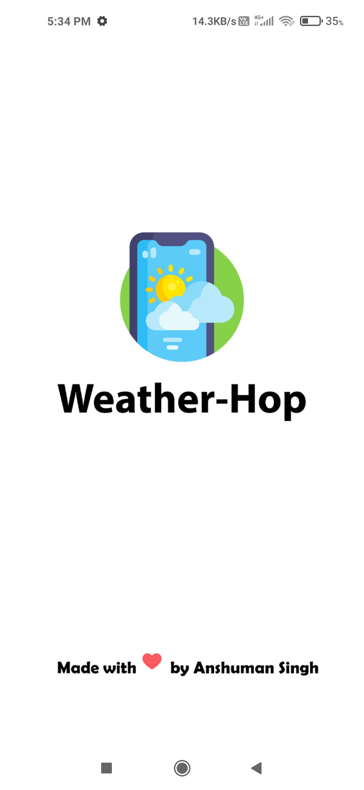
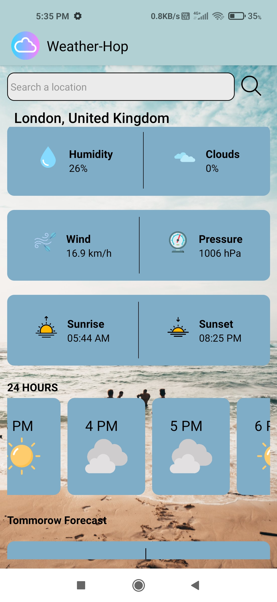

<a name="readme-top"></a>

<!-- PROJECT LOGO -->
<br />
<div align="center">
  <a href="https://github.com/MrSingh2000/weather-app-android">
    
  </a>

  <h3 align="center">Weather-Hop</h3>

  <p align="center">
    An awesome Weather App for Android
    <br />
    <a href="https://drive.google.com/file/d/1YGo4XrOvms0Cvvp2sXN7_ytXmULr4Pu0/view?usp=sharing">View Demo</a>
    ·
    <a href="https://github.com/MrSingh2000/weather-app-android/issues">Report Bug</a>
    ·
    <a href="https://github.com/MrSingh2000/weather-app-android/issues">Request Feature</a>
  </p>
</div>


<!-- TABLE OF CONTENTS -->
<details>
  <summary>Table of Contents</summary>
  <ol>
    <li>
      <a href="#about-the-project">About The Project</a>
      <ul>
        <li><a href="#built-with">Built With</a></li>
      </ul>
    </li>
    <li>
      <a href="#getting-started">Getting Started</a>
      <ul>
        <li><a href="#prerequisites">Prerequisites</a></li>
        <li><a href="#installation">Installation</a></li>
      </ul>
    </li>
    <li><a href="#usage">Usage</a></li>
    <li><a href="#roadmap">Roadmap</a></li>
    <li><a href="#contributing">Contributing</a></li>
    <li><a href="#license">License</a></li>
    <li><a href="#contact">Contact</a></li>
    <li><a href="#acknowledgments">Acknowledgments</a></li>
  </ol>
</details>


<!-- ABOUT THE PROJECT -->
## About The Project
<a href="https://drive.google.com/file/d/1YGo4XrOvms0Cvvp2sXN7_ytXmULr4Pu0/view?usp=sharing">

</a>


A simple yet usefull weather application made using React Native including various features.

Features the app provides :-

* Uses user's location on startup to get weather info
* Gives 24 hours information about the weather
* Gives details about today's weather in details, including atmospheric pressure and humidity levels.
* Forecasts next day weather details.

If you wanna add your taste to the existing application, feel free to fork the repo and just start working on your local machine!

<p align="right">(<a href="#readme-top">back to top</a>)</p>


### Built With


* [](https://reactjs.org/)
* [](https://reactnative.dev/)
* [](http://expo.io/)

<p align="right">(<a href="#readme-top">back to top</a>)</p>


<!-- GETTING STARTED -->
## Getting Started

Set up the project locally on your system following instructions on setting up your project.
To get a local copy up and running, follow these simple steps.


### Prerequisites

Installing latest Package Manager

- npm
  ```sh
  npm install npm@latest -g
  ```
- yarn
  ```sh
  yarn install yarn@latest -g
  ```

### Installation

1. Clone the repo
   ```sh
   git clone https://github.com/MrSingh2000/chat-app.git
   ```
2. Installing expo CLI
   ```sh
   npm install --global expo-cli
   ```
   ```sh
   expo install
   ```
3. Setting up environment variables in `.env`

   ```txt
   API_KEY = 'your_API_key_here'
   ```
   NOTE: API key can be generated by creating an account at weatherapi.com
4. Start the application
    ```sh
    expo start
    ```

<p align="right">(<a href="#readme-top">back to top</a>)</p>


<!-- USAGE EXAMPLES -->
## Usage

For demonstration purposes some screenshots of the application are attached below.




<p align="right">(<a href="#readme-top">back to top</a>)</p>

<!-- CONTACT -->
## Contact

[](https://www.linkedin.com/in/anshuman-singh-856991201/)

[](https://github.com/MrSingh2000)

[](https://www.instagram.com/mr_singh2000/)


<p align="right">(<a href="#readme-top">back to top</a>)</p>


<!-- MARKDOWN LINKS & IMAGES -->
<!-- https://www.markdownguide.org/basic-syntax/#reference-style-links -->
[contributors-shield]: https://img.shields.io/github/contributors/MrSingh2000/weather-app-android.svg?style=for-the-badge
[contributors-url]: https://github.com/MrSingh2000/weather-app-android/graphs/contributors
[forks-shield]: https://img.shields.io/github/forks/MrSingh2000/weather-app-android.svg?style=for-the-badge
[forks-url]: https://github.com/MrSingh2000/weather-app-android/network/members
[stars-shield]: https://img.shields.io/github/stars/MrSingh2000/weather-app-android.svg?style=for-the-badge
[stars-url]: https://github.com/MrSingh2000/weather-app-android/stargazers
[issues-shield]: https://img.shields.io/github/issues/MrSingh2000/weather-app-android.svg?style=for-the-badge
[issues-url]: https://github.com/MrSingh2000/weather-app-android/issues
[license-shield]: https://img.shields.io/github/license/MrSingh2000/weather-app-android.svg?style=for-the-badge
[license-url]: https://github.com/MrSingh2000/weather-app-android/blob/master/LICENSE.txt
[linkedin-shield]: https://img.shields.io/badge/-LinkedIn-black.svg?style=for-the-badge&logo=linkedin&colorB=555
[linkedin-url]: https://linkedin.com/in/othneildrew
[product-screenshot]: readme/spash.jpg
[product-homepage]: readme/2.jpg
[Native]: https://img.shields.io/badge/ReactNative-20232A?style=for-the-badge&logo=react&logoColor=61DAFB
[React.js]: https://img.shields.io/badge/React-20232A?style=for-the-badge&logo=react&logoColor=61DAFB
[React-url]: https://reactjs.org/
[Native-url]: https://reactnative.dev/